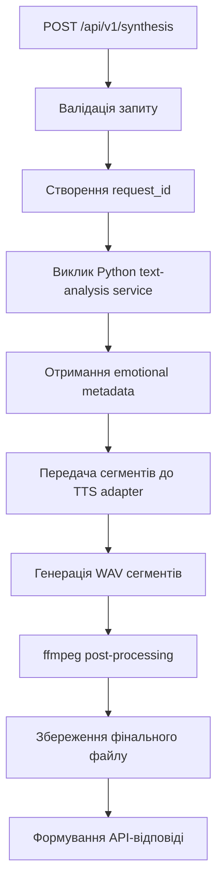

# Архітектура backend для Emotional TTS

## 1. Призначення backend-рівня
Backend не повинен містити всю бізнес-логіку в одному місці. Його задача — бути **оркестратором** між:
- front-end застосунком;
- Python-сервісом аналізу тексту;
- TTS-рівнем на базі Piper;
- аудіоутилітами на базі ffmpeg;
- системою збереження результатів.

## 2. Роль backend у поточному каркасі
Backend реалізовано як **gateway service** на **TypeScript + Fastify** у директорії `src/apps/gateway`.

Його зона відповідальності:
- приймати зовнішні HTTP-запити;
- валідовувати вхідні дані;
- ініціювати pipeline синтезу;
- обробляти збої сервісів;
- зберігати статус задачі;
- віддавати клієнту результат у стабільному форматі.

## 3. Чому саме gateway
Gateway потрібен, щоб:
- ізолювати front-end від внутрішніх сервісів;
- не давати UI прямий доступ до Python-логіки;
- не викликати Piper напряму з браузера;
- мати одну публічну точку входу;
- спростити майбутню заміну окремих модулів.

## 4. Сервіси всередині backend-контуру

```text
Frontend
  -> Gateway API
      -> Text Analysis Service (Python)
      -> TTS Adapter (Python FastAPI)
          -> Piper (CLI)
      -> ffmpeg (post-processing всередині TTS adapter)
      -> Storage / Output Registry
```

## 5. Основні модулі gateway

### 5.1 API layer
Відповідає за:
- маршрути;
- DTO;
- схеми валідації;
- формування HTTP-відповідей.

### 5.2 Orchestration layer
Відповідає за:
- запуск етапів pipeline у правильному порядку;
- передавання даних між етапами;
- фіксацію стану обробки;
- rollback або cleanup тимчасових файлів у разі збою.

### 5.3 Integration layer
Відповідає за клієнти:
- `textAnalysisClient`
- `ttsClient`
- `audioUtilsClient`
- `storageClient`

### 5.4 Domain layer
Відповідає за:
- типи сутностей;
- статуси задач;
- конфігурацію режимів синтезу;
- правила fallback-поведінки.

## 6. Рекомендований життєвий цикл запиту



## 7. Режими роботи

### Синхронний режим для MVP
Підходить, якщо синтез короткий:
- клієнт надсилає текст;
- backend обробляє все в одному запиті;
- клієнт одразу отримує результат.

### Асинхронний режим для наступного етапу
Потрібен, якщо:
- текст довгий;
- синтез триває довше;
- потрібен прогрес-статус.

Тоді додаються:
- `POST /jobs`
- `GET /jobs/:id`
- `GET /jobs/:id/result`

Для MVP достатньо спроєктувати backend так, щоб асинхронний режим можна було додати без переписування доменної логіки.

## 8. Рекомендовані API-ендпоїнти

### POST `/api/v1/synthesis`
Призначення: запуск повного циклу синтезу.

Приклад запиту:
```json
{
  "text": "Привіт 😊! Я дуже радий тебе чути!",
  "voiceId": "uk-voice-01",
  "mode": "expressive",
  "outputFormat": "mp3"
}
```

Приклад відповіді:
```json
{
  "requestId": "req_001",
  "status": "completed",
  "audio": {
    "path": "/outputs/generated/req_001/final.mp3",
    "format": "mp3",
    "durationMs": 4210
  },
  "metadataPath": "/outputs/generated/req_001/metadata.json"
}
```

### POST `/api/v1/analyze`
Призначення: окремо перевірити text-analysis без синтезу.

### GET `/api/v1/health`
Призначення: перевірка стану gateway.

### GET `/api/v1/dependencies`
Призначення: перевірка доступності Python service, Piper та ffmpeg.

## 9. Правила валідації
Gateway повинен перевіряти:
- що `text` не порожній;
- що `voiceId` входить до дозволеного набору;
- що `mode` має значення `neutral` або `expressive`;
- що `outputFormat` входить до дозволених форматів;
- що довжина тексту не перевищує ліміт MVP.

## 10. Правила помилок
Backend має повертати передбачувані помилки:
- `400` — невалідний запит;
- `422` — текст прийнятий, але аналіз не може побудувати коректні metadata;
- `502` — недоступний внутрішній сервіс;
- `500` — внутрішня помилка pipeline.

Відповідь на помилку:
```json
{
  "requestId": "req_001",
  "status": "failed",
  "error": {
    "code": "TTS_PROVIDER_UNAVAILABLE",
    "message": "Сервіс синтезу тимчасово недоступний"
  }
}
```

## 11. Структура backend-проєкту (фактична для monorepo)
```text
src/
  apps/
    gateway/
      src/
        app.ts              # точка входу Fastify
        routes/             # HTTP-маршрути (health, tts тощо)
        controllers/        # тонкі контролери над services
        services/
          tts-orchestrator.service.ts   # координація викликів text-analysis та tts-adapter
        clients/
          text-analysis.client.ts       # HTTP-клієнт до Python text-analysis
          tts-adapter.client.ts         # HTTP-клієнт до TTS adapter
        schemas/            # DTO/validation схеми
        domain/             # типи, статуси задач, конфіг
        utils/
      test/
```

## 12. Що не повинен робити backend
- не повинен містити правила emoji-to-emotion усередині route handlers;
- не повинен зберігати бізнес-логіку у фронтенді;
- не повинен напряму підлаштовувати текст під конкретний один голос Piper без adapter layer;
- не повинен змішувати логіку збереження файлів і HTTP-контролери.

## 13. Рекомендовані технічні правила
- усі DTO мають бути типізованими;
- маршрути мають мати JSON Schema або еквівалентну строгість;
- інтеграційні клієнти повинні бути ізольованими від контролерів;
- усі тимчасові файли мають створюватися в окремому каталозі запиту;
- логування повинно містити `requestId` на кожному етапі.

## 14. Мінімальний результат для MVP
Backend вважається реалізованим у поточному каркасі, якщо він:
- приймає текст;
- викликає Python-сервіс аналізу (коли він підключений);
- викликає TTS adapter для синтезу;
- делегує ffmpeg post-processing на рівень adapter-а;
- повертає готовий аудіорезультат і шлях до metadata.
