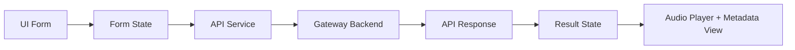

# Архітектура front-end для Emotional TTS

## 1. Призначення front-end
Front-end не повинен бути місцем, де приймаються рішення про емоцію, сегментацію чи аудіообробку. Його роль — **керована взаємодія з користувачем**.

Front-end відповідає за:
- введення тексту;
- вибір голосу і режиму;
- запуск синтезу;
- відображення статусу;
- відтворення результату;
- показ службової інформації для дебагу.

## 2. Рекомендований стек
- **React**
- **TypeScript**
- мінімальний UI-kit або власні компоненти
- аудіоплеєр браузера
- HTTP-клієнт для виклику gateway API

## 3. Головний принцип UI
Front-end має бути **тонким клієнтом**. Він не повинен:
- дублювати parser logic;
- будувати власний emotion mapping;
- запускати ffmpeg у браузері;
- напряму працювати з Piper.

## 4. Основні екрани MVP

### 4.1 Головна форма синтезу
Містить:
- textarea для тексту;
- список голосів;
- перемикач `neutral / expressive`;
- вибір формату `wav / mp3`;
- кнопку запуску.

### 4.2 Блок результату
Містить:
- статус генерації;
- аудіоплеєр;
- кнопку завантаження;
- короткий підсумок metadata.

### 4.3 Блок діагностики
Для MVP корисно показувати:
- виділені сегменти;
- emotion labels;
- intensity;
- попередження про неоднозначні випадки.

## 5. Потік даних у front-end



## 6. Стан застосунку
Для MVP достатньо поділити стан на:
- `formState`
- `requestState`
- `resultState`
- `errorState`

### formState
- `text`
- `voiceId`
- `mode`
- `outputFormat`

### requestState
- `idle`
- `loading`
- `success`
- `error`

### resultState
- `requestId`
- `audioPath`
- `durationMs`
- `metadata`

## 7. Компонентна структура (у межах monorepo)
```text
src/
  apps/
    web/
      src/
        app/                # кореневий App/entry
        pages/
          home/             # головна сторінка playground
        components/
          synthesis-form/
          voice-selector/
          mode-switch/
          result-panel/
          metadata-preview/
          audio-player/
          error-banner/
        services/
          synthesis-api.ts  # клієнт до gateway API
        hooks/
        types/
        utils/
```

## 8. Рекомендований поділ компонентів

### Контейнерні компоненти
Мають працювати з API та станом:
- `HomePage`
- `SynthesisContainer`

### Презентаційні компоненти
Мають лише відображати дані:
- `SynthesisForm`
- `ResultPanel`
- `AudioPlayer`
- `MetadataPreview`

## 9. Правила UX для MVP
- кнопка запуску блокується під час `loading`;
- текст помилки показується явно;
- користувач завжди бачить, у якому режимі згенерований файл;
- metadata preview можна згортати, щоб не перевантажувати інтерфейс;
- довгі запити мають супроводжуватися індикатором стану.

## 10. Що варто показувати користувачу
У базовій відповіді достатньо показати:
- підсумковий emotion label по сегментах;
- інтенсивність;
- формат файлу;
- шлях або кнопку download;
- час генерації.

## 11. Чого не треба показувати в MVP
- усі внутрішні технічні поля parser-а;
- службові шляхи до тимчасових WAV-сегментів;
- низькорівневі ffmpeg команди;
- stack trace помилки.

## 12. Типи даних на фронтенді
Усі контракти мають бути типізовані. Приклад:
```ts
export interface SynthesisRequest {
  text: string;
  voiceId: string;
  mode: 'neutral' | 'expressive';
  outputFormat: 'wav' | 'mp3';
}

export interface SegmentMetadata {
  segmentId: number;
  text: string;
  emotion: 'neutral' | 'joy' | 'playful' | 'sadness' | 'anger' | 'surprise';
  intensity: 0 | 1 | 2 | 3;
  pauseAfterMs?: number;
}
```

## 13. API service layer
Front-end повинен звертатися до backend не з компонентів напряму, а через окремий сервіс:
- `createSynthesis()`
- `analyzeText()`
- `getHealth()`

Це спрощує:
- тестування;
- заміну endpoint-ів;
- централізовану обробку помилок.

## 14. Мінімальний шлях користувача
1. Користувач вставляє текст.
2. Обирає голос.
3. Вмикає `expressive` або `neutral`.
4. Натискає кнопку синтезу.
5. Чекає завершення.
6. Отримує аудіо і metadata preview.

## 15. Критерії готовності front-end
Front-end вважається готовим для MVP, якщо:
- працює форма введення;
- коректно викликається gateway API;
- показується результат синтезу;
- помилки відображаються зрозуміло;
- відтворення аудіо працює стабільно.
