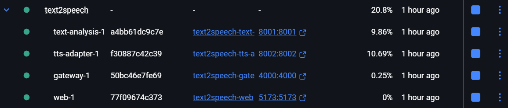

# API Testing Review (Postman Baseline)
## Overview
This document summarizes the results of the API testing performed via Postman to verify the stability and functional logic of the Emotional TTS pipeline. The primary goal was to confirm that all microservices are communicating correctly and to evaluate the current accuracy of the emotion mapping logic.

## Service Readiness (Health Checks)
All system components were verified using their respective /health endpoints. The services are stable and reachable within the local Docker environment .
| Service        | Endpoint           | Status          | Port |
|----------------|--------------------|-----------------|------|
| Gateway        | GET /health        | PASS (200 OK)   | 4000 |
| Text Analysis  | GET /health        | PASS (200 OK)   | 8001 |
| TTS Adapter    | GET /health        | PASS (200 OK)   | 8002 |

## Functional Testing Results

### 1. Text Analysis (`POST /api/analyze`)

Tested the core logic of segmenting text and assigning emotional metadata.

- **Segmentation:** Text is correctly split into sentences or logical chunks.

- **Emotion Mapping Observation:**
  - The system successfully identifies **"joy"** when positive cues (like ASCII emoticons `:)`) are present [Response example](./screenshots/joy_example.png).
  - **Issue:** All other emotional cues (including those that should trigger *"sadness"* or *"anger"*) currently default to **"neutral"** [Response example](./screenshots/neutral_example.png).

---

### 2. Synthesis Pipeline (`POST /api/tts`)

Verified the end-to-end flow from text input to audio file generation.

- **WAV Generation:** The system consistently returns a valid `audioUrl`.
- **Accessibility:** Audio files are accessible and playable via the browser [screenshot](./screenshots/audio_in_browser.png).

---

## Key Findings & Bug Log

| Input Text                     | Expected Emotion | Detected Emotion | Status                          |
|------------------------------|------------------|------------------|---------------------------------|
| "I am so happy! :)"          | joy              | joy              | ✅ SUCCESS                      |
| "I am very sad..."           | sadness          | neutral          | ❌ FAIL (Defaults to neutral)   |
| "What are you doing?!"       | surprise/anger   | neutral          | ❌ FAIL (Defaults to neutral)   |

---

## Observations

- **Limited Emotion Palette:** Only the **"joy"** label is functioning as intended in the current mapping logic.
- **Unicode Handling:** Unicode emojis (e.g., 😊) do not currently trigger emotional metadata and are often ignored or spoken literally by the TTS engine.

---

## Conclusion

The infrastructure is **100% stable and production-ready** in terms of service communication.  
However, the *machine learning* aspect of the emotion mapping requires immediate attention to expand the supported emotion set beyond **"joy"** and **"neutral"**.
